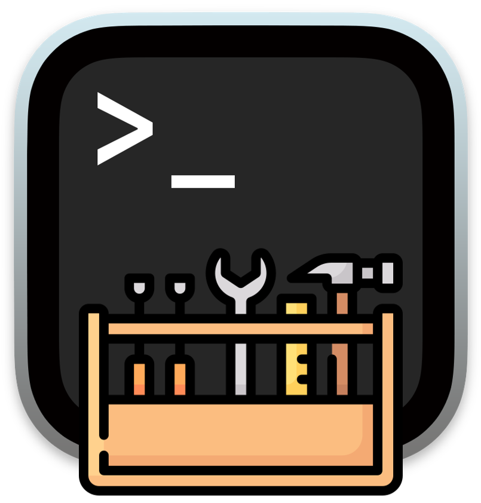

<div align="center">
  
</div>

# TUIKit

[](https://www.nuget.org/packages/TUIKit/) [](https://www.nuget.org/packages/TUIKit) [](LICENSE.md) [](https://dotnet.microsoft.com/)

A concurrent, high-performance terminal UI framework for .NET. TUIKit lets you drop a multi-pane, live-updating interface into an ordinary console application — the kind of surface an AI agent harness needs: a streaming transcript on one side, tool output and telemetry on another, an input composer at the bottom, and modal dialogs on top of it all.

> **v0.1.0 — Alpha.** This is the first public preview. The API and capabilities are subject to change. It is usable and tested, but treat it as pre-1.0: pin your version and expect breaking changes between minor releases until it stabilizes.

## What it is

TUIKit is a library, not an application. You reference it, describe a layout as a set of rectangles, bind panes to those rectangles, register some keybindings, and hand control to a host that owns the render and input loops. It is built for the case where **several threads write at once**: a background worker can call `pane.WriteLine(...)` while the render thread repaints, and TUIKit handles the ordering, the diffing, and the minimization of escape sequences for you.

It multi-targets `netstandard2.0`, `net8.0`, and `net10.0`. The modern targets are dependency-free; `netstandard2.0` pulls in a small compatibility shim so the same code runs on .NET Framework, Mono, and Unity.

## What it does

- **Developer-defined regions.** Declare any number of rectangles, each with its own resize behavior — fixed, edge-anchored, stretch, or proportional — plus per-rectangle padding. TUIKit reflows them when the window changes and shows a "terminal too small" screen when it can't fit.
- **Thread-safe, mutable content.** Any thread may write to any pane; writes are FIFO per pane. Lines can be updated in place, so a tool call goes `running…` → `done (1.2s)` and a progress bar advances without redrawing the world.
- **Streaming with a smart scroll lock.** Scroll up to detach from the live tail; return to the bottom to re-attach. A `↓ N new` indicator tells you what you're missing.
- **Rich text.** A fluent styled-text builder, a Markdown renderer for agent output, word/character wrapping, and correct Unicode column width for CJK, combining marks, and emoji grapheme clusters.
- **Enhanced input.** A byte decoder for UTF-8, control keys, arrows, function keys, the Kitty/CSI-u protocol, SGR mouse, and bracketed paste — routed through a central command table with scopes, multi-key chords (`Ctrl+K Ctrl+T`), and a configurable Ctrl+C policy.
- **Mouse, links, and selection.** Click-to-focus, hover scroll, virtual links with per-frame hit-testing and a security allowlist for auto-linkification, text selection, and OSC 52 clipboard copy that works over SSH.
- **Modals, notifications, and widgets.** A focus-trapping modal stack with async results, non-focus-stealing toasts, and a widget toolkit: label, gauge, sparkline, progress bar, spinner, list, table, multi-line editor, text field, checkbox, and radio group.
- **Theming and diagnostics.** Dark, light, and high-contrast themes with an ASCII-border fallback; a debug overlay; frame statistics; and input record/replay.
- **Headless rendering.** Render to an in-memory cell buffer and assert it as text. It's how TUIKit tests itself, and it's a shipped feature so you can snapshot-test your own UI.

## Why use it

Most console UI libraries assume a single-threaded, immediate-mode loop and a rigid split layout. An agent harness breaks both assumptions. Output arrives in a flood of tokens from one thread while tool calls mutate their status lines from another, the operator scrolls back through history without losing the live tail, and a confirmation dialog can appear at any moment.

TUIKit is designed around that reality. Panes are retained objects that own their state, so a background thread writing to one is natural rather than a special case. Rendering is a double-buffered diff that emits only the cells that changed and coalesces styling, so a 100 Hz token stream doesn't turn into 100 full repaints. And because the whole thing renders into an in-memory buffer, you can test your interface deterministically instead of eyeballing a terminal.

If you are building a chat client, an agent control panel, a log viewer, a deployment dashboard, or any long-running console tool where content moves on its own, TUIKit gives you the concurrency model and the rendering discipline to do it without reinventing them.

## How it works

TUIKit is a stack of small, testable layers. Each one is useful on its own and none of them reach into the internals of the layer above.

1. **Terminal backend** (`ITerminalBackend`) — the raw sink for output bytes and source for input bytes. `ConsoleBackend` drives a real terminal (VT enabled via `SetConsoleMode` on Windows, `stty` raw mode on Unix). `HeadlessBackend` captures everything in memory for tests.
2. **Renderer** (`TerminalRenderer`) — composes a frame into a back buffer, diffs it against what's on screen, and emits the minimal set of escape sequences to reconcile them. Truecolor is quantized to 256/16 colors when the terminal can't do better.
3. **Layout** (`Layout`, `Region`) — resolves each region's rectangle from its constraints and padding for the current surface size, and derives the minimum size below which it shows the block screen.
4. **Content** (`Pane`) — a thread-safe, scrolling, mutable text surface with a capped ring buffer, mutable line handles, and the smart scroll lock.
5. **Input** (`InputParser`, `CommandRoutingTable`) — decodes raw bytes into key, mouse, and paste events and routes them by scope, honoring multi-key chords and the Ctrl+C policy.
6. **Host** (`TuiApplication`) — ties it together: it owns the render and input loops, dispatches commands, manages the modal stack and notifications, restores the terminal on exit, and degrades to plain line output when stdout isn't a TTY.

## Installation

```bash
dotnet add package TUIKit
```

Or add it to your project file:

```xml
<PackageReference Include="TUIKit" Version="0.1.0" />
```

## Quick start

A two-pane app — a scrolling log above a prompt line — with a background thread streaming into it and `Ctrl+Q` to quit:

```csharp
using System.Threading;
using System.Threading.Tasks;
using TUIKit;
using TUIKit.Content;
using TUIKit.Hosting;
using TUIKit.Input;
using TUIKit.Layout;
using TUIKit.Terminal;

using ConsoleBackend backend = new ConsoleBackend();
using TuiApplication app = new TuiApplication(backend);

// Two rectangles: a log that fills the space above a 3-row prompt.
app.Layout = Layout.Create()
    .Add("log",    r => r.FillWidth().FillHeight(0, 3))
    .Add("prompt", r => r.FillWidth().BottomAnchored(0, 3))
    .Build();

Pane log = new Pane("log");
app.BindPane("log", log);

// Global keybinding -> command.
app.Commands.Register(KeyChord.Parse("ctrl+q"), "quit");
app.RegisterCommand("quit", () => app.RequestStop());

// Any thread may write to a pane; ordering is FIFO per pane.
_ = Task.Run(async () =>
{
    for (int i = 1; i <= 100; i++)
    {
        log.WriteLine(Text.From($"event {i}").Green());
        await Task.Delay(50);
    }
});

await app.RunAsync(CancellationToken.None);
```

## Example application

A complete, runnable demo lives in [`src/TUIKit.Example`](src/TUIKit.Example) — a simulated **agent control harness** that exercises every major capability against a fake agent (no network, no model), so it is deterministic and self-contained. Its README carries a [capability-coverage matrix](src/TUIKit.Example/README.md) mapping each library feature to the exact interaction that demonstrates it.

### Walkthrough

1. **Run it.**

   ```bash
   dotnet run --project src/TUIKit.Example
   ```

   You land in a full-screen harness: a header bar, a streaming transcript on the left, a tool panel and live telemetry on the right, a bordered composer along the bottom, and a footer of shortcuts.

2. **Watch it stream.** The simulated agent writes Markdown tokens into the transcript from a background thread — headings, bold, lists, a block quote, a fenced code block, and a link — while a tool call runs and its status line mutates from `running` to `done (0.9s)` in place. The telemetry panel updates a gauge, a sparkline, a progress bar, and a table every frame.

3. **Press `F1` (or `?`).** A help overlay lists every keybinding. The demo documents itself.

4. **Type into the composer and press `Enter`.** Your message is echoed into the transcript. `Alt+Enter` inserts a newline; the composer is a full multi-line editor with undo/redo (`Ctrl+Z` / `Ctrl+Y`) and a kill ring (`Ctrl+K` / `Ctrl+U`).

5. **Scroll with `PageUp` / `PageDown`.** Scrolling up detaches the transcript from the live tail — the footer shows `detached N new` — and returning to the bottom re-attaches it. The mouse wheel scrolls whichever pane is under the cursor.

6. **Open the command palette with `Ctrl+P`.** A list widget in a modal; choose an action with the arrow keys and `Enter`. `Ctrl+G` opens a settings form with a radio group, a checkbox, and a text field, with `Tab` moving focus between them. `Ctrl+L` raises a confirmation dialog ("the agent wants to run `rm -rf build/`") whose result drives a toast.

7. **Cycle the theme with `Ctrl+K Ctrl+T`** (a two-key chord) and toggle the debug overlay with `Ctrl+D` to see every region's outline and the frame timing. High-contrast mode switches borders to ASCII.

8. **Quit.** `Ctrl+Q` exits cleanly and restores your terminal. `Ctrl+C` is configured to require a double-tap.

### Headless and non-interactive modes

The example renders a single frame to text without a terminal, which is how you would snapshot a UI in CI:

```bash
dotnet run --project src/TUIKit.Example -- --once          # print one frame to stdout
dotnet run --project src/TUIKit.Example -- --once --debug   # ... with the debug overlay
dotnet run --project src/TUIKit.Example | cat               # non-TTY -> plain line output
```

## Terminal support

Tier-1, intended targets are Windows Terminal, iTerm2, Ghostty, WezTerm, Alacritty, and kitty — including over SSH and inside tmux. Terminals that can't report enhanced keys or truecolor (macOS Terminal.app, legacy conhost, PuTTY) run in a degraded mode with capability reporting rather than failing. When stdout is not a TTY, TUIKit emits plain line output instead of escape sequences.

## Building and testing

```bash
dotnet build src/TUIKit.sln

# Console test runner (colored, tabular output; exit code 0/1)
dotnet run --project src/Test.Automated
dotnet run --project src/Test.Automated -- --results results.json

# The same test descriptors through xUnit and NUnit
dotnet test src/Test.Xunit
dotnet test src/Test.Nunit
```

Tests are written with [Touchstone](https://github.com/jchristn/touchstone): one set of descriptors in `Test.Shared` runs identically through the console runner, xUnit, and NUnit. See [`docs/SURFACE_COVERAGE.md`](docs/SURFACE_COVERAGE.md) for the coverage audit.

## Project status

Alpha. The core is implemented and tested end to end, and the example harness runs. A few features described in the design are still in progress — suspend/resume and POSIX signal restoration, OSC 8 hyperlink emission by the renderer, keyboard link-hint labels, live drag selection, and a benchmark suite. Coverage of the platform-specific backend and the interactive loop relies on manual smoke testing rather than automated headless tests. See [`TUIKIT_PLAN.md`](TUIKIT_PLAN.md) for the full phase breakdown.

## Contributing, issues, and discussions

Bug reports, feature requests, and questions are all welcome on GitHub:

- **File a bug or request a feature:** open an issue at [github.com/jchristn/TUIKit/issues](https://github.com/jchristn/TUIKit/issues). For a bug, include your OS, terminal, target framework, and the smallest snippet that reproduces it — a headless snapshot (`Snapshot.ToText`) of the misbehaving frame is ideal.
- **Start a discussion or propose a direction:** use [github.com/jchristn/TUIKit/discussions](https://github.com/jchristn/TUIKit/discussions) for design questions, ideas, and "should this work like X?" conversations before a PR.
- **Pull requests:** please open an issue or discussion first for anything non-trivial so the API direction can be agreed on while it's still alpha. Match the existing code style (documented in [`CLAUDE.md`](CLAUDE.md)) and add Touchstone descriptors for new behavior.

## License

TUIKit is released under the [MIT License](LICENSE.md). Copyright (c) 2026 Joel Christner.
