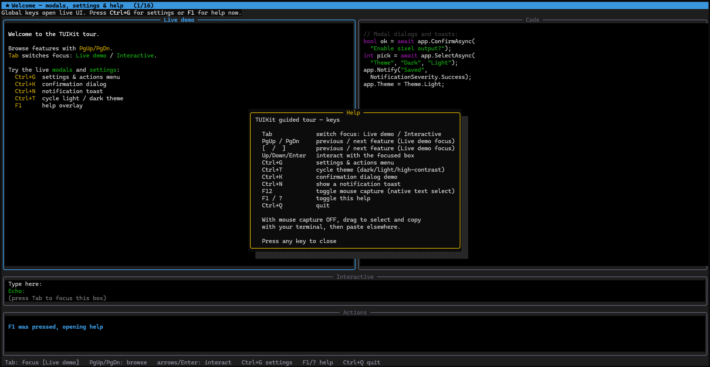
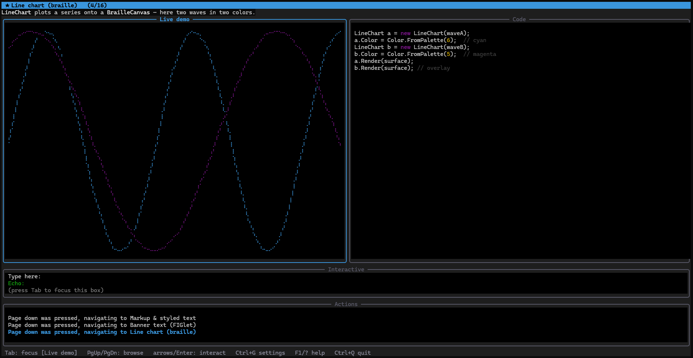
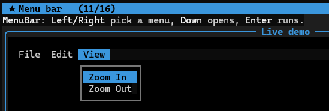
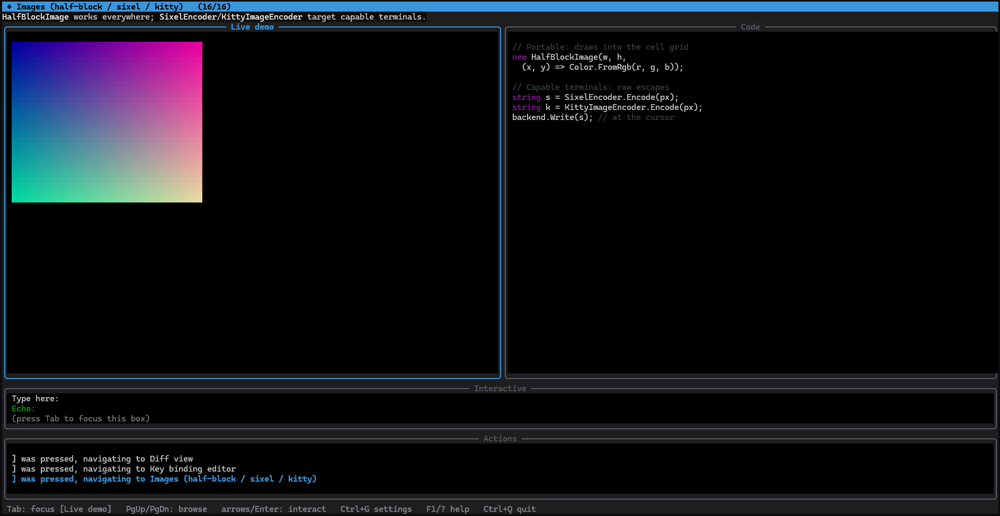

<div align="center">
  
</div>

# TUIKit

[](https://www.nuget.org/packages/TUIKit/) [](LICENSE.md) [](https://dotnet.microsoft.com/)

A concurrent, high-performance terminal UI framework for .NET. TUIKit lets you drop a multi-pane, live-updating interface into an ordinary console application — the kind of surface an AI agent harness needs: a streaming transcript on one side, tool output and telemetry on another, an input composer at the bottom, and modal dialogs on top of it all.

> **v1.0.0 — stable.** TUIKit is out of alpha: the API is now stable and follows [semantic versioning](https://semver.org/). This release lands the **fullscreen-rendering** capabilities a full-viewport, flicker-free TUI depends on, all cross-platform across Windows, macOS, and Linux: **synchronized output** (DEC mode 2026) presents each frame atomically so fast streams never tear, a persistent **full-repaint mode** covers terminals that drop incremental updates (some ConPTY / Windows Terminal setups), and a cross-platform **`SuspendAsync`** shell-out hands the terminal to an external editor or pager and restores the session cleanly. The one source-level break is a new ninth `TerminalCapabilities` constructor parameter (`synchronizedOutput`). See the [**changelog**](CHANGELOG.md) for the full release history.

**Quick links:** [Building Terminal Apps guide](BUILDING_TERMINAL_APPS.md) · [Runnable example](src/TUIKit.Example) · [Changelog](CHANGELOG.md) · [Contributing](#contributing-issues-and-discussions)

> **See it live** in ~30 seconds — a self-describing guided tour of every feature, with the code beside each one:
>
> ```bash
> dotnet run --project src/TUIKit.Example              # guided tour
> dotnet run --project src/TUIKit.Example -- --contract # the interaction-contract demo
> ```

<details>
<summary><strong>Screenshots</strong></summary>

<br />

<a href="assets/ss1.png"></a>

<a href="assets/ss2.png"></a>

<a href="assets/ss3.png"></a>

<a href="assets/ss4.png"></a>

</details>

## What it is

TUIKit is a library, not an application. You reference it, describe a layout as a set of rectangles, bind panes to those rectangles, register some keybindings, and hand control to a host that owns the render and input loops. It is built for the case where **several threads write at once**: a background worker can call `pane.WriteLine(...)` while the render thread repaints, and TUIKit handles the ordering, the diffing, and the minimization of escape sequences for you.

It multi-targets `netstandard2.0`, `net8.0`, and `net10.0`. The modern targets are dependency-free; `netstandard2.0` pulls in a small compatibility shim so the same code runs on .NET Framework, Mono, and Unity.

## What it does

- **Developer-defined regions.** Declare any number of rectangles, each with its own resize behavior — fixed, edge-anchored, stretch, or proportional — plus per-rectangle padding and an optional background (an explicit color or a named theme role, so a sidebar or status strip is tinted and restyles with the theme). TUIKit reflows them when the window changes and shows a "terminal too small" screen when it can't fit.
- **Thread-safe, mutable content.** Any thread may write to any pane; writes are FIFO per pane. Lines can be updated in place, so a tool call goes `running…` → `done (1.2s)` and a progress bar advances without redrawing the world.
- **Streaming with a smart scroll lock.** Scroll up to detach from the live tail; return to the bottom to re-attach. A `↓ N new` indicator tells you what you're missing.
- **Rich text.** A fluent styled-text builder, inline markup (`[bold red]…[/]`), a Markdown renderer (headings, lists, task lists, tables, blockquotes, code), word/character wrapping, and correct Unicode column width for CJK, combining marks, and emoji grapheme clusters.
- **Enhanced input.** A byte decoder for UTF-8, control keys, arrows, function keys, the Kitty/CSI-u protocol, SGR mouse, and bracketed paste — routed through a central command table with scopes, multi-key chords (`Ctrl+K Ctrl+T`), and a configurable Ctrl+C policy. Carriage return (`Enter`) and line feed (`Ctrl+J`) decode distinctly, so you can bind `Ctrl+J` as a newline chord that works even where the terminal can't report `Shift+Enter`.
- **Mouse, links, and selection.** Full pointer support: click-to-focus, single/double/triple click synthesis, drag, vertical **and horizontal** wheel, and **hover** — any-motion tracking (on by default, with per-frame move coalescing) delivers `Enter`/`Leave` events synthesized from a per-frame hit-test map, so widgets highlight under the pointer. Terminal **focus reporting** (`TerminalFocusChanged`) lets an app dim itself when the window blurs. Virtual links get per-frame hit-testing, a security allowlist for auto-linkification, hover tracking (`LinkHovered` for status-bar URL previews), OSC 8 hyperlink emission, and keyboard link hints; text selection and OSC 52 clipboard copy work over SSH. A one-key toggle hands the mouse back to the terminal for native drag-select, and `MouseTrackingMode` drops to drag-only or off for chatty links. See [Mouse support by environment](#mouse-support-by-environment) for the exact matrix.
- **A host-owned interaction contract.** The host wires the interactive skeleton for you: a **focus ring** across bound focusable widgets (`Focus`, `FocusNext`/`FocusPrevious`, `FocusChanged`, `Tab` traversal, `FocusContext` that follows focus), an explicit **key-precedence chain** (modal → pre-filter → focus-scoped commands → focused-widget first refusal → global commands → fallback), **click-to-focus** and wheel routing from a per-frame hit-test map, and application-shell **dock layout helpers** (`DockTop`/`DockBottom`/`DockLeft`/`DockRight`/`Fill`). It's all additive — the raw `KeyReceived`/`MouseReceived`/`RenderOverlay` hooks still work.
- **Modals, notifications, and prompts.** A focus-trapping modal stack with awaitable, **typed** results (`ShowAsync<T>`, plus `ConfirmAsync` / `PromptAsync` / `SelectAsync`), a reusable `DialogModal` base that auto-sizes a centered box with a title and footer hint so custom dialogs stop hand-rolling geometry, a `MultiSelectModal<T>` for choosing several options, a `Post(Action)` loop scheduler for marshalling continuations back onto the UI thread, non-focus-stealing toasts, and a global focus manager for `Tab` order.
- **A broad widget toolkit.** Inputs (text field with optional character masking for secret entry such as passwords and tokens, multi-line editor with undo and a kill ring, checkbox, radio group, forms); selection (`CheckList<T>` multi-select, sortable virtualized `DataTable<T>`, tree, tabs, fuzzy finder, list); navigation (menu bar, file browser, scroll view, collapsible section, status bar); status and feedback (a `DefinitionList` labeled-value panel, `ActivityIndicator` working line, gauge, sparkline, progress bar, spinner, concurrent multi-task progress); a `Rule` divider; plus a user-editable key-binding editor.
- **Selection and editing lists.** Generic `ListView<T>` and `FuzzyList<T>` return the selected object (not a string), `ActionListView<T>` gives rows keyboard actions with a typed result, and `ReorderableList<T>` moves and removes items in place.
- **Command surfaces and typeahead.** A `CommandRegistry` drives key bindings, a grouped menu bar, a fuzzy command palette, and a `/slash` router from one command list, and an `AutocompleteOverlay` (with a pluggable `ISuggestionProvider`) shows caret-anchored suggestions for any text input.
- **Streaming and text helpers.** A `StreamingTranscript` that projects streamed text and keyed in-place status lines onto a pane (finalizing each block as Markdown), plus `HintText` footer wrapping, `ColumnFormatter` column alignment, and a `SubmitKeyResolver` that settles the cross-terminal Enter-vs-newline question for multi-line editors.
- **Charts, diffs, and images.** Braille line and bar charts, a sparkline, and three distribution widgets — a `BoxPlotChart` (horizontal box-and-whisker over a caller-supplied five-number summary such as min / avg / p95 / p99 / max), a `Histogram` (bucketed frequency with the eighth-block ramp, live via `Push`), and a `HeatMap` (a grid of cells shaded by magnitude) — plus a diff viewer with syntax highlighting, FIGlet-style banners, a color picker, and image rendering — half-block on any terminal, sixel or kitty where supported.
- **Text-to-ASCII-art.** A font engine (`TUIKit.Ascii`) that turns text into large multi-row art with faithful FIGlet layout — full-width, kerning, and the six horizontal smushing rules. `AsciiFontLibrary.Default` ships 84 built-in fonts (Standard, Slant, the Small family, Doom, Colossal, ANSI Shadow, Sub-Zero, and more); `AsciiArtText` drops any of them into a layout, and `FigletFontLoader` loads your own `.flf`/`.tlf` files. Fonts with restrictive licensing are not bundled.
- **Reactive and animated.** Thread-safe `Observable<T>` one-way data binding, and deterministic, tick-driven animation (`Easing`, `Tween`, `FrameTimer`) that replays identically in tests.
- **Theming and diagnostics.** Dark, light, and high-contrast themes with an ASCII-border fallback; a debug overlay; frame statistics; and input record/replay.
- **Full-viewport, flicker-free rendering.** A double-buffered diff renderer repaints only changed rows and coalesces SGR runs; **synchronized output** (DEC mode 2026) presents each frame atomically so fast streams never tear; a persistent **full-repaint mode** covers backends that drop incremental updates; and a cross-platform **`SuspendAsync`** shell-out hands the terminal to an external editor or pager and restores the alternate screen afterward. The terminal is restored on every exit path — clean quit, Ctrl+C, or unhandled exception.
- **Headless rendering.** Render to an in-memory cell buffer and assert it as text. It's how TUIKit tests itself, and it's a shipped feature so you can snapshot-test your own UI.

## Why use it

Most console UI libraries assume a single-threaded, immediate-mode loop and a rigid split layout. An agent harness breaks both assumptions. Output arrives in a flood of tokens from one thread while tool calls mutate their status lines from another, the operator scrolls back through history without losing the live tail, and a confirmation dialog can appear at any moment.

TUIKit is designed around that reality. Panes are retained objects that own their state, so a background thread writing to one is natural rather than a special case. Rendering is a double-buffered diff that emits only the cells that changed and coalesces styling, so a 100 Hz token stream doesn't turn into 100 full repaints. And because the whole thing renders into an in-memory buffer, you can test your interface deterministically instead of eyeballing a terminal.

If you are building a chat client, an agent control panel, a log viewer, a deployment dashboard, or any long-running console tool where content moves on its own, TUIKit gives you the concurrency model and the rendering discipline to do it without reinventing them.

### How it compares

- **vs. [Spectre.Console](https://spectreconsole.net/):** Spectre excels at rich one-shot output — tables, prompts, and progress in a linear program. TUIKit is a **retained, concurrent, full-screen** framework: panes are long-lived objects that many threads write to while a diffing renderer repaints, which is what a live dashboard or agent harness needs.
- **vs. [Terminal.Gui](https://github.com/gui-cs/Terminal.Gui):** Terminal.Gui is a classic desktop-style widget toolkit (windows, menus, dialogs). TUIKit shares much of that toolkit but is oriented toward **streaming content and headless snapshot testing** — you render into an in-memory buffer and assert it as text, so your UI is unit-testable rather than eyeballed.
- **Dependency-free** on modern targets, multi-targeting `netstandard2.0`/`net8.0`/`net10.0`, and self-contained Unicode/width handling (no `System.Text`-heavy detours, no native deps).

## How it works

TUIKit is a stack of small, testable layers. Each one is useful on its own and none of them reach into the internals of the layer above.

1. **Terminal backend** (`ITerminalBackend`) — the raw sink for output bytes and source for input bytes. `ConsoleBackend` drives a real terminal (VT enabled via `SetConsoleMode` on Windows, in-process `termios` raw mode on Unix). `HeadlessBackend` captures everything in memory for tests.
2. **Renderer** (`TerminalRenderer`) — composes a frame into a back buffer, diffs it against what's on screen, and emits the minimal set of escape sequences to reconcile them. Truecolor is quantized to 256/16 colors when the terminal can't do better.
3. **Layout** (`Layout`, `Region`) — resolves each region's rectangle from its constraints and padding for the current surface size, and derives the minimum size below which it shows the block screen.
4. **Content** (`Pane`) — a thread-safe, scrolling, mutable text surface with a capped ring buffer, mutable line handles, and the smart scroll lock.
5. **Input** (`InputParser`, `CommandRoutingTable`) — decodes raw bytes into key, mouse, and paste events and routes them by scope, honoring multi-key chords and the Ctrl+C policy.
6. **Host** (`TuiApplication`) — ties it together: it owns the render and input loops, drives the focus ring and the key-precedence chain, hit-tests the mouse for click-to-focus, wheel routing, and hover Enter/Leave synthesis (with move coalescing so any-motion tracking stays cheap), stamps multi-click counts on presses, dispatches commands and terminal focus changes, manages the modal stack and notifications, restores the terminal on exit, and degrades to plain line output when stdout isn't a TTY.

## Installation

```bash
dotnet add package TUIKit
```

Or add it to your project file:

```xml
<PackageReference Include="TUIKit" Version="1.0.0" />
```

## Quick start

A two-pane app — a scrolling log above a prompt line — with a background thread streaming into it and `Ctrl+Q` to quit. One call (`TuiApp.RunAsync`) owns the terminal, the render loop, and the input loop:

```csharp
using System.Threading;
using System.Threading.Tasks;
using TUIKit;
using TUIKit.Content;
using TUIKit.Hosting;

await TuiApp.RunAsync(app =>
{
    // Two rectangles: a log that fills the space above a 3-row prompt.
    Pane log = app.AddPane("log", r => r.FillWidth().FillHeight(0, 3));
    app.AddPane("prompt", r => r.FillWidth().BottomAnchored(0, 3));

    // Bind a chord straight to an action.
    app.Bind("Ctrl+Q", app.Quit);

    // Any thread may write to a pane; ordering is FIFO per pane.
    _ = Task.Run(async () =>
    {
        for (int i = 1; i <= 100; i++)
        {
            log.WriteLine(Text.From($"event {i}").Green());
            await Task.Delay(50);
        }
    });
},
CancellationToken.None);
```

Prefer to wire things up by hand? Construct a `ConsoleBackend` and a `TuiApplication`, set `app.Layout`, `BindPane`, register commands, and `await app.RunAsync(...)` yourself — the [Building Terminal Apps guide](BUILDING_TERMINAL_APPS.md) shows both paths.

## Example application

A complete, runnable demo lives in [`src/TUIKit.Example`](src/TUIKit.Example) — a simulated **agent control harness** that exercises every major capability against a fake agent (no network, no model), so it is deterministic and self-contained. Its README carries a [capability-coverage matrix](src/TUIKit.Example/README.md) mapping each library feature to the exact interaction that demonstrates it.

### Walkthrough

1. **Run it.**

   ```bash
   dotnet run --project src/TUIKit.Example
   ```

   You land in a full-screen harness: a header bar, a streaming transcript on the left, a tool panel and live telemetry on the right, a bordered composer along the bottom, and a footer of shortcuts.

2. **Watch it stream.** The simulated agent writes Markdown tokens into the transcript from a background thread — headings, bold, lists, a block quote, a fenced code block, and a link — while a tool call runs and its status line mutates from `running` to `done (0.9s)` in place. The telemetry panel updates a gauge, a sparkline, a progress bar, and a table every frame.

3. **Press `F1` (or `?`).** A help overlay lists every keybinding. The demo documents itself.

4. **Type into the composer and press `Enter`.** Your message is echoed into the transcript. `Alt+Enter` inserts a newline; the composer is a full multi-line editor with undo/redo (`Ctrl+Z` / `Ctrl+Y`) and a kill ring (`Ctrl+K` / `Ctrl+U`).

5. **Scroll with `PageUp` / `PageDown`.** Scrolling up detaches the transcript from the live tail — the footer shows `detached N new` — and returning to the bottom re-attaches it. The mouse wheel scrolls whichever pane is under the cursor.

6. **Open the command palette with `Ctrl+P`.** A list widget in a modal; choose an action with the arrow keys and `Enter`. `Ctrl+G` opens a settings form with a radio group, a checkbox, and a text field, with `Tab` moving focus between them. `Ctrl+L` raises a confirmation dialog ("the agent wants to run `rm -rf build/`") whose result drives a toast.

7. **Cycle the theme with `Ctrl+K Ctrl+T`** (a two-key chord) and toggle the debug overlay with `Ctrl+D` to see every region's outline and the frame timing. High-contrast mode switches borders to ASCII.

8. **Quit.** `Ctrl+Q` exits cleanly and restores your terminal. `Ctrl+C` is configured to require a double-tap.

### Headless and non-interactive modes

The example renders a single frame to text without a terminal, which is how you would snapshot a UI in CI:

```bash
dotnet run --project src/TUIKit.Example -- --once          # print one frame to stdout
dotnet run --project src/TUIKit.Example -- --once --debug   # ... with the debug overlay
dotnet run --project src/TUIKit.Example -- --contract-once  # the interaction-contract demo frame
dotnet run --project src/TUIKit.Example | cat               # non-TTY -> plain line output
```

The **interaction-contract demo** (`--contract`) is the shortest path to seeing the host at work: a four-way dock shell (header, sidebar, editor, footer) built from real regions, a focus ring you drive with `Tab` or the mouse, a focus-scoped `Enter` that opens a file in the sidebar while `Enter` in the editor inserts a newline, a two-key theme chord, and a typed picker modal marshalled back onto the loop with `Post` — the whole app in ~120 lines of [`ContractDemo.cs`](src/TUIKit.Example/ContractDemo.cs).

## Terminal support

Interactive keyboard, rendering, and terminal restoration have been tested and validated on **Windows** (Windows Terminal), **macOS** (iTerm2), and **Linux**, including over an **SSH** session — the same raw-mode input path (native `SetConsoleMode` on Windows, libc `termios` on Unix) behaves identically across all three.

Tier-1, intended targets are Windows Terminal, iTerm2, Ghostty, WezTerm, Alacritty, and kitty — including over SSH and inside tmux. Terminals that can't report enhanced keys or truecolor (macOS Terminal.app, legacy conhost, PuTTY) run in a degraded mode with capability reporting rather than failing. When stdout is not a TTY, TUIKit emits plain line output instead of escape sequences.

### Mouse support by environment

TUIKit speaks one mouse dialect everywhere — SGR (DECSET 1006) extended reporting with button
tracking (1000), drag motion (1002), any-motion hover (1003), and focus reporting (1004). On
Windows, `ENABLE_VIRTUAL_TERMINAL_INPUT` makes the console translate native mouse input into the
same escape sequences a Unix terminal emits, so a single parser serves every platform. Modes a
terminal lacks are silently ignored, so every ⚠️/❌ below degrades gracefully — the app keeps
running and that feature simply doesn't fire.

| Environment | Click / drag / wheel | Hover / any-motion | Horizontal wheel | Focus in/out | Coords > 223 cols | Notes |
|---|---|---|---|---|---|---|
| Windows Terminal (Win 10/11) | ✅ | ✅ | ✅ | ✅ | ✅ | Primary Windows target; full VT input translation. |
| Legacy conhost (Win 10+) | ⚠️ | ⚠️ | ❌ | ❌ | ✅ | VT mouse translation is partial and version-dependent; TUIKit clears QuickEdit so events aren't swallowed by selection mode. Pre-VT conhost (Win 8.1 and earlier) gets no mouse at all. |
| macOS Terminal.app | ✅ | ⚠️ | ❌ | ⚠️ | ✅ | Drag tracking works; any-motion and focus reporting vary by macOS version — hover degrades to drag-only where 1003 is ignored. |
| iTerm2 | ✅ | ✅ | ✅ | ✅ | ✅ | Full support. |
| kitty / Alacritty / WezTerm / Ghostty | ✅ | ✅ | ✅ | ✅ | ✅ | Full support. |
| VTE terminals (GNOME Terminal, Tilix, xfce4-terminal) | ✅ | ✅ | ✅ | ✅ | ✅ | Full support. |
| xterm | ✅ | ✅ | ✅ | ✅ | ✅ | Reference implementation of every mode used. |
| tmux (`set -g mouse on`) | ✅ | ✅ | ⚠️ | ✅ | ✅ | Requires mouse enabled in tmux; tmux consumes some events for its own panes; horizontal-wheel forwarding depends on tmux version. With `mouse off`, no events reach the app. |
| GNU screen | ⚠️ | ❌ | ❌ | ❌ | ⚠️ | screen's pass-through is limited to basic tracking; treat as keyboard-first. |
| SSH (any client) | — | — | — | — | — | Transparent: capability is that of the *client* terminal emulator — the rows above apply to whatever the user runs locally. |
| WSL | — | — | — | — | — | Transparent: capability is that of the hosting console (usually Windows Terminal → full support). |
| Headless / redirected / CI | ❌ (by design) | ❌ | ❌ | ❌ | — | `IsInteractive` is false; no escape sequences are emitted. Tests inject synthetic events instead. |

Deliberately out of scope, and why:

| Capability | Why not |
|---|---|
| Pixel-precision coordinates (DECSET 1016) | Terminal support is spotty and TUIKit's rendering model is a cell grid; cell granularity is the reliable cross-platform contract. |
| Legacy mouse encodings (X10, UTF-8 1005, urxvt 1015) | SGR 1006 is ubiquitous in every terminal that reports the mouse at all today; the legacy encodings add ambiguity and coordinate-ceiling bugs for terminals that effectively no longer exist. Terminals without SGR fall back to keyboard-only operation via `TerminalCapabilities.SgrMouse`. |
| Mouse events outside the terminal window / global position | No terminal protocol reports the pointer outside the window. `Leave` is synthesized for transitions between widgets and out of bound regions. |
| Pointer cursor shape changes on hover | No standardized escape sequence with wide enough support to build API on. |
| Pre-Windows-10 consoles | No `ENABLE_VIRTUAL_TERMINAL_INPUT`, so no VT mouse translation exists to consume. |

## Building and testing

```bash
dotnet build src/TUIKit.sln

# Console test runner (colored, tabular output; exit code 0/1)
dotnet run --project src/Test.Automated
dotnet run --project src/Test.Automated -- --results results.json

# The same test descriptors through xUnit and NUnit
dotnet test src/Test.Xunit
dotnet test src/Test.Nunit
```

Tests are written with [Touchstone](https://github.com/jchristn/touchstone): one set of descriptors in `Test.Shared` runs identically through the console runner, xUnit, and NUnit. See [`docs/SURFACE_COVERAGE.md`](docs/SURFACE_COVERAGE.md) for the coverage audit.

## Project status

**Stable — 1.0.** The core — plus the full widget, layout, reactive, animation, testing, and terminal-integration surface — is implemented and covered by an extensive suite of [Touchstone](https://github.com/jchristn/touchstone) cases that run identically through the console, xUnit, and NUnit runners on `net8.0` and `net10.0` (363 cases in the console runner as of 0.6.0). The 0.6 line added per-region background colors and a batch of horizontal components — a `DialogModal` base, `CheckList<T>`/`MultiSelectModal<T>`, generic `ListView<T>`/`FuzzyList<T>`, `ActionListView<T>`, `ReorderableList<T>`, `DefinitionList`, `ActivityIndicator`, `StreamingTranscript`, a `CommandRegistry`, focus-following `ScrollView`, and small text/input utilities — and shipped **autocomplete/typeahead** (`AutocompleteOverlay`), the one capability the original build plan had held back, so every catalogued capability now ships. The host owns an interaction contract: a focus ring, an explicit key-precedence chain with focused-widget first refusal, mouse hit-testing for click-to-focus and wheel routing, typed modals, and application-shell dock helpers — so a standard interactive app is "bind widgets, set focus, run." The 0.8 line adds a text-to-ASCII-art font engine (`TUIKit.Ascii`): `AsciiArt.Render` with faithful FIGlet layout (full-width, kerning, and the six horizontal smushing rules), a thread-safe `AsciiFontLibrary` manager whose `Default` ships 84 built-in fonts, a `FigletFontLoader` for `.flf`/`.tlf` files, and the `AsciiArtText` widget — with per-font attribution bundled and a licensing gate that would exclude any restrictive font; v0.8.1 hardens terminal restore on exit so Ctrl+C or an unhandled exception can no longer leave the shell with mouse reporting or raw input mode enabled, and v0.8.2–0.8.3 add uniform PageUp/PageDown and Home/End navigation across every list and scroll widget; v0.9.0 fixes bracketed paste into a focused prompt or inline add field so an Access key, Secret key, password, or token pastes instead of being silently dropped; and v0.10.0 completes mouse support — hover with synthesized Enter/Leave, tracking-mode control, horizontal wheel, terminal focus reporting, host-stamped multi-click counts, link hover, widget hover styles, and the conhost QuickEdit fix; and v1.0.0 lands the fullscreen-rendering capabilities — synchronized output (DEC mode 2026), a persistent full-repaint mode, and a cross-platform `SuspendAsync` shell-out — and takes the project stable (580 console cases as of 1.0.0). Still outstanding: a benchmark suite. The platform-specific `ConsoleBackend` and the interactive run loop are validated by manual smoke testing rather than headless tests, and have been confirmed working on Windows, macOS, and Linux, including over SSH. See [`CHANGELOG.md`](CHANGELOG.md) and [`archive/TUIKIT_PLAN.md`](archive/TUIKIT_PLAN.md) for detail.

## Contributing, issues, and discussions

Bug reports, feature requests, and questions are all welcome on GitHub:

- **File a bug or request a feature:** open an issue at [github.com/jchristn/TUIKit/issues](https://github.com/jchristn/TUIKit/issues). For a bug, include your OS, terminal, target framework, and the smallest snippet that reproduces it — a headless snapshot (`Snapshot.ToText`) of the misbehaving frame is ideal.
- **Start a discussion or propose a direction:** use [github.com/jchristn/TUIKit/discussions](https://github.com/jchristn/TUIKit/discussions) for design questions, ideas, and "should this work like X?" conversations before a PR.
- **Pull requests:** please open an issue or discussion first for anything non-trivial so the API direction can be agreed on before it lands. Match the existing code style (documented in [`CLAUDE.md`](CLAUDE.md)) and add Touchstone descriptors for new behavior.

## License

TUIKit is released under the [MIT License](LICENSE.md). Copyright (c) 2026 Joel Christner.

## Logo Attribution

The TUIKit logo is composed from the following sources:

- [Terminalicon2](https://commons.wikimedia.org/wiki/File:Terminalicon2.png) — Wikimedia Commons
- [Toolkit icon](https://www.flaticon.com/free-icon/toolkit_7854841) — Flaticon
